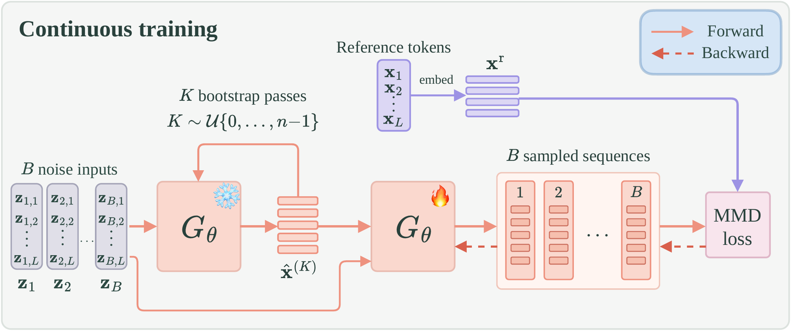

# ELF-MMD

This branch provides the PyTorch implementation of ELF-MMD from *Representation-Space MMD for Diffusion Language Models*. It supports post-training and evaluation of [ELF](https://arxiv.org/abs/2605.10938) models on OpenWebText and TinyGSM.

<p align="center">
  
</p>

## Installation

```bash
git clone https://github.com/yandex-research/dlm-mmd.git
cd dlm-mmd
git checkout elf-mmd
```

Create a conda environment named `elf` and install the dependencies:

```bash
conda create -n elf python=3.10 -y
conda activate elf
pip install -r requirements.txt
```

Optionally, log in to Weights & Biases (W&B) to track your experiments:

```bash
wandb login YOUR_WANDB_API_KEY
```

Set `use_wandb: true` in your config to enable logging.

## Checkpoints

We provide pretrained ELF checkpoints and checkpoints post-trained with MMD or MMD followed by IRD.

**Pretrained ELF models** (used to initialize MMD training):

| Model | Task | Encoder | Checkpoint |
| --- | --- | --- | --- |
| ELF-B | OpenWebText (unconditional) | T5-small | [🤗 embedded-language-flows/ELF-B-owt-torch](https://huggingface.co/embedded-language-flows/ELF-B-owt-torch) |
| ELF-B | OpenWebText (unconditional) | GPT-2 Large | [🤗 yresearch/ELF-MMD-OWT/gpt2/elf](https://huggingface.co/yresearch/ELF-MMD-OWT/tree/main/gpt2/elf) |
| ELF-B | TinyGSM (conditional) | GPT-2 | [🤗 yresearch/ELF-MMD-TinyGSM/ELF-B/elf](https://huggingface.co/yresearch/ELF-MMD-TinyGSM/tree/main/ELF-B/elf) |
| ELF-M | TinyGSM (conditional) | GPT-2 | [🤗 yresearch/ELF-MMD-TinyGSM/ELF-M/elf](https://huggingface.co/yresearch/ELF-MMD-TinyGSM/tree/main/ELF-M/elf) |

**Post-trained models:**

| Model | Task | Encoder | ELF-MMD | ELF-MMD + IRD |
| --- | --- | --- | --- | --- |
| ELF-B | OpenWebText | T5-small | [🤗 Checkpoint](https://huggingface.co/yresearch/ELF-MMD-OWT/tree/main/t5/elf-mmd) | [🤗 Checkpoint](https://huggingface.co/yresearch/ELF-MMD-OWT/tree/main/t5/elf-mmd-ird) |
| ELF-B | OpenWebText | GPT-2 Large | [🤗 Checkpoint](https://huggingface.co/yresearch/ELF-MMD-OWT/tree/main/gpt2/elf-mmd) | [🤗 Checkpoint](https://huggingface.co/yresearch/ELF-MMD-OWT/tree/main/gpt2/elf-mmd-ird) |
| ELF-B | TinyGSM | GPT-2 | [🤗 Checkpoint](https://huggingface.co/yresearch/ELF-MMD-TinyGSM/tree/main/ELF-B/elf-mmd) | [🤗 Checkpoint](https://huggingface.co/yresearch/ELF-MMD-TinyGSM/tree/main/ELF-B/elf-mmd-ird) |
| ELF-M | TinyGSM | GPT-2 | [🤗 Checkpoint](https://huggingface.co/yresearch/ELF-MMD-TinyGSM/tree/main/ELF-M/elf-mmd) | [🤗 Checkpoint](https://huggingface.co/yresearch/ELF-MMD-TinyGSM/tree/main/ELF-M/elf-mmd-ird) |

## Reference Results

Columns indicate the number of sampling steps. For OpenWebText, compare generative perplexity (lower is better) alongside unigram entropy, using the dataset entropy ($H \approx 5.43$) as a reference. For TinyGSM, higher accuracy is better.

**OpenWebText — T5 encoder**

| Method | Metric | 2 steps | 4 steps | 8 steps | 16 steps | 32 steps |
| --- | --- | ---: | ---: | ---: | ---: | ---: |
| ELF-MMD | Gen. PPL ↓ / Entropy | 192.28 / 5.53 | 110.07 / 5.49 | 56.63 / 5.45 | 43.01 / 5.41 | 39.79 / 5.40 |
| ELF-MMD + IRD | Gen. PPL ↓ / Entropy | 141.03 / 5.47 | 78.11 / 5.44 | 47.33 / 5.39 | 38.83 / 5.35 | 35.75 / 5.33 |

**OpenWebText — GPT-2 encoder**

| Method | Metric | 2 steps | 4 steps | 8 steps | 16 steps | 32 steps |
| --- | --- | ---: | ---: | ---: | ---: | ---: |
| ELF-MMD | Gen. PPL ↓ / Entropy | 127.77 / 5.39 | 85.61 / 5.45 | 56.52 / 5.45 | 44.34 / 5.44 | 40.01 / 5.43 |
| ELF-MMD + IRD | Gen. PPL ↓ / Entropy | 114.32 / 5.36 | 77.55 / 5.42 | 53.48 / 5.43 | 43.20 / 5.42 | 39.34 / 5.42 |

**TinyGSM — accuracy (%) ↑**

| Method | 1 step | 2 steps | 4 steps | 8 steps | 16 steps | 32 steps | 64 steps |
| --- | ---: | ---: | ---: | ---: | ---: | ---: | ---: |
| ELF-MMD | 0.71 | 4.00 | 14.21 | 27.49 | 34.16 | 34.28 | 35.24 |
| ELF-MMD + IRD | 1.33 | 7.46 | 20.76 | 32.46 | 35.62 | 35.97 | 36.30 |

## Evaluation

Evaluate the post-trained models across the sampling step counts specified in their configs:

```bash
# ELF-B-MMD
NGPU=8 bash scripts/launch.sh eval src/configs/mmd/elf-b_tinygsm.yml \
    --config_override output_dir=outputs/eval-elf-b-mmd_tinygsm

# ELF-B-MMD + IRD
NGPU=8 bash scripts/launch.sh eval src/configs/ird/elf-b_tinygsm.yml \
    --config_override output_dir=outputs/eval-elf-b-mmd_ird_tinygsm
```

## Data Preparation

The datasets below are already tokenized for their corresponding encoders. The presets download and cache them automatically, so no additional preprocessing is required to use them.

| Dataset / encoder | Hugging Face dataset |
| --- | --- |
| OpenWebText / T5-small | 🤗 [embedded-language-flows/openwebtext-t5](https://huggingface.co/datasets/embedded-language-flows/openwebtext-t5) |
| OpenWebText / GPT-2 Large | 🤗 [yresearch/owt-gpt2](https://huggingface.co/datasets/yresearch/owt-gpt2) |
| TinyGSM / GPT-2 | 🤗 [yresearch/tinygsm-gpt2](https://huggingface.co/datasets/yresearch/tinygsm-gpt2) |

The GPT-2 OpenWebText presets use the `train` split. TinyGSM presets use `train` for training and `test` for evaluation; these are selected by `data_split` and `eval_data_split`.

Hub loading uses all files for the selected split. For a complete local saved dataset, point to its directory; a direct `.arrow` path loads only that file.

### Preprocessing custom data

For TinyGSM-style data, create separate train/test JSONL files with `input` (prompt) and `output` (reference response) fields:

```python
from datasets import load_dataset
from transformers import AutoTokenizer

tokenizer = AutoTokenizer.from_pretrained("gpt2")
dataset = load_dataset("json", data_files={"train": "train.jsonl", "test": "test.jsonl"})

def tokenize(example):
    return {
        "condition_input_ids": tokenizer(example["input"], add_special_tokens=False)["input_ids"],
        "input_ids": tokenizer(example["output"], add_special_tokens=False)["input_ids"],
        "target": example["output"],
    }

dataset.map(tokenize).save_to_disk("data/custom")  # Keeps `input` for evaluation.
```

Point your config to the saved dataset:

```yaml
data_path: data/custom
data_split: train
eval_data_path: data/custom
eval_data_split: test
```

For OpenWebText-style data, use `t5-small` or `gpt2-large` to match the encoder, load only a `train` split with a `text` field, and replace `tokenize` with:

```python
def tokenize(example):
    return {"input_ids": tokenizer(example["text"])["input_ids"]}
```

OpenWebText only needs `data_path` and `data_split`. TinyGSM evaluation also accepts raw `input`/`output` JSONL via `eval_data_path`. The loader handles truncation and padding; keep encoder, padding token, and latent normalization settings matched to the teacher checkpoint.

## Training

Launch single-GPU training from the repository root:

```bash
bash scripts/launch.sh train src/configs/mmd/t5_owt.yml
```

Launch training on multiple GPUs on a single machine:

```bash
CUDA_VISIBLE_DEVICES=0,1 NGPU=2 bash scripts/launch.sh train src/configs/mmd/elf-b_tinygsm.yml
```

| Dataset / model | MMD config | IRD config |
| --- | --- | --- |
| OpenWebText / T5-small | [mmd/t5_owt.yml](src/configs/mmd/t5_owt.yml) | [ird/t5_owt.yml](src/configs/ird/t5_owt.yml) |
| OpenWebText / GPT-2 Large | [mmd/gpt2_owt.yml](src/configs/mmd/gpt2_owt.yml) | [ird/gpt2_owt.yml](src/configs/ird/gpt2_owt.yml) |
| TinyGSM / ELF-B | [mmd/elf-b_tinygsm.yml](src/configs/mmd/elf-b_tinygsm.yml) | [ird/elf-b_tinygsm.yml](src/configs/ird/elf-b_tinygsm.yml) |
| TinyGSM / ELF-M | [mmd/elf-m_tinygsm.yml](src/configs/mmd/elf-m_tinygsm.yml) | [ird/elf-m_tinygsm.yml](src/configs/ird/elf-m_tinygsm.yml) |

## Acknowledgements

This repository builds on the [PyTorch implementation of ELF](https://github.com/lillian039/ELF/tree/pytorch_elf). We thank the authors for making their code available.
