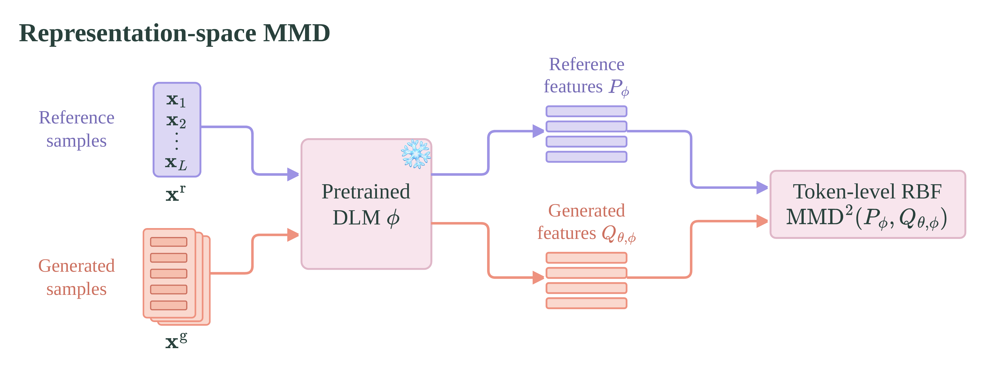

<h1 align="center">Representation-Space MMD for Diffusion Language Models</h1>

[](https://arxiv.org/abs/2610.06648) [](https://huggingface.co/collections/yresearch/dmax-mmd) [](LICENSE)


This is the official PyTorch implementation of the paper _Representation-Space MMD for Diffusion
Language Models_. This branch (`main`) post-trains the released 16B
[DMax](https://github.com/czg1225/DMax) models, which use hybrid masked–uniform block diffusion,
and evaluates them with DMax's original dInfer pipeline. The other experiments of the paper live
on separate branches:

- [`mdlm-mmd`](https://github.com/yandex-research/dlm-mmd/tree/mdlm-mmd): MMD post-training of
  [MDLM](https://github.com/kuleshov-group/mdlm).
- [`elf-mmd`](https://github.com/yandex-research/dlm-mmd/tree/elf-mmd): MMD post-training of
  [ELF](https://github.com/lillian039/ELF).

## Updates

- **[Oct 6, 2026]**: Code and DMax-MMD checkpoints released.
- **[Oct 6, 2026]**: Paper released on [arXiv](https://arxiv.org/abs/2610.06648).

## Highlights

<p align="center">
  
</p>

- **A distribution-level objective for diffusion LMs.** We post-train with the Maximum Mean
  Discrepancy (MMD) between the model's own samples and reference responses, measured in the
  representation space of a frozen DLM, rather than with token-level cross-entropy.
- **Faster parallel decoding at the same or better accuracy.** On DMax, MMD post-training raises
  the number of tokens decoded per forward pass (TPF) on every math and code benchmark.
- **Cheap.** Post-training takes only 400 optimizer steps, about 13 minutes for Math and 18 minutes for Coder on 8×H100 GPUs.

## Installation

```bash
git clone https://github.com/yandex-research/dlm-mmd.git
cd dlm-mmd
```

Training and evaluation use separate environments.

**Training environment**:

```bash
conda create -n dmax-mmd python=3.11 -y && conda activate dmax-mmd
pip install -r requirements.txt
```

**Evaluation environment**, the same as for DMax's original dInfer evaluator:

```bash
conda create -n dinfer python=3.11 -y && conda activate dinfer
# sglang 0.5.3.post1 needs flashinfer-python 0.4.0, whose pinned build dependency
# apache-tvm-ffi==0.1.0b15 is no longer on PyPI. Build it against the 0.1.0 release.
curl -sSLO https://files.pythonhosted.org/packages/source/f/flashinfer_python/flashinfer_python-0.4.0.tar.gz
tar xzf flashinfer_python-0.4.0.tar.gz
sed -i 's/apache-tvm-ffi==0.1.0b15/apache-tvm-ffi==0.1.0/' \
  flashinfer_python-0.4.0/pyproject.toml flashinfer_python-0.4.0/requirements.txt
pip wheel --no-deps ./flashinfer_python-0.4.0 -w wheels
# Install in DMax's order: sglang and vllm cannot be resolved together, and vllm overrides
# some of sglang's pins (for example xgrammar), as in the upstream environment.
pip install --find-links wheels sglang==0.5.3.post1
pip install --find-links wheels vllm==0.10.2
pip install "lm_eval[math]" evaluate astor accelerate
```

## Checkpoints

We provide post-trained checkpoints (downloaded automatically by `scripts/eval.sh`):

| Model | Checkpoint |
| --- |  --- |
| DMax-Math-MMD (16B) | 🤗 [yresearch/DMax-Math-MMD](https://huggingface.co/yresearch/DMax-Math-MMD) |
| DMax-Coder-MMD (16B) | 🤗 [yresearch/DMax-Coder-MMD](https://huggingface.co/yresearch/DMax-Coder-MMD) |

## Reference results

Accuracy (%) / tokens per forward (TPF) on math and code benchmarks, with decoding threshold 0.85
for math and 0.9 for code (the defaults of `scripts/eval.sh`). Baseline results are taken from the
original DMax paper.

| Method | GSM8K | MATH500 | Minerva-Algebra | ASDIV | HumanEval-Instruct | MBPP-Instruct |
| --- | :---: | :---: | :---: | :---: | :---: | :---: |
| DMax-Math | 92.1 / 5.48 | 75.4 / 5.94 | 91.5 / 7.03 | 92.5 / 5.62 | – | – |
| **DMax-Math-MMD** | 92.1 / **6.15** | **76.0** / **6.84** | **92.1** / **8.19** | **92.9** / **6.20** | – | – |
| DMax-Coder | – | – | – | – | 83.5 / 7.36 | 79.2 / 5.86 |
| **DMax-Coder-MMD** | – | – | – | – | **85.9** / **8.07** | **83.0** / **6.10** |

Small differences can come from the hardware, the number of tensor-parallel GPUs and library
versions, which change the attention and MoE kernels.

## Evaluation

`scripts/eval.sh` runs the DMax evaluator on every benchmark of a domain and prints a results
table at the end. Use the `dinfer` environment:

```bash
conda activate dinfer

# Released checkpoints (downloaded from Hugging Face)
DOMAIN=math bash scripts/eval.sh    # GSM8K, MATH500, Minerva-Algebra, ASDIV at threshold 0.85
DOMAIN=code bash scripts/eval.sh    # HumanEval-Instruct, MBPP-Instruct at threshold 0.9

# A checkpoint trained with this repository, or any other local or Hugging Face model
DOMAIN=math MODEL_PATH=YOUR_MODEL_PATH bash scripts/eval.sh
DOMAIN=math MODEL_PATH=Zigeng/DMax-Math-16B bash scripts/eval.sh
```

## Training

We post-train the checkpoints released by the DMax authors on their own training trajectories.
Both are downloaded from Hugging Face automatically.

| Domain | Initial checkpoint (DMax) | Training data (DMax) |
| --- | --- | --- |
| Math | 🤗 [Zigeng/DMax-Math-16B](https://huggingface.co/Zigeng/DMax-Math-16B) | 🤗 [Zigeng/DMax-LLaDA-2.0-Mini-Math-Trajectories](https://huggingface.co/datasets/Zigeng/DMax-LLaDA-2.0-Mini-Math-Trajectories) |
| Code | 🤗 [Zigeng/DMax-Coder-16B](https://huggingface.co/Zigeng/DMax-Coder-16B) | 🤗 [Zigeng/DMax-LLaDA-2.0-Mini-Code-Trajectories](https://huggingface.co/datasets/Zigeng/DMax-LLaDA-2.0-Mini-Code-Trajectories) |

Use the training environment and eight GPUs:

```bash
conda activate dmax-mmd

DOMAIN=math bash scripts/train.sh              # DMax-Math-MMD, seed 0
DOMAIN=code SEED=3 bash scripts/train.sh       # DMax-Coder-MMD, seed 3
DOMAIN=math bash scripts/train.sh optimizer.lr=1e-6   # override any config key
```

The checkpoint is saved to `outputs/dmax_<domain>_mmd/seed<SEED>/final_model`, together with the
training log (`training.jsonl`) and the full config (`resolved_config.yaml`). Evaluate it with
`MODEL_PATH=outputs/dmax_<domain>_mmd/seed<SEED>/final_model`.

## Acknowledgement

This code builds on [DMax](https://github.com/czg1225/DMax): the data transform and LLaDA2 model
code in [`vendor/`](vendor) are adapted from it under the Apache-2.0 license (see
[`vendor/DMAX_LICENSE`](vendor/DMAX_LICENSE) and [`vendor/llada2/NOTICE.md`](vendor/llada2/NOTICE.md)),
and evaluation runs DMax's copy of the [dInfer](https://github.com/inclusionAI/dInfer) evaluator.
We thank the authors for releasing their models, data and code.


## Citation

If you find this work useful in your research, please consider citing our paper:

```bibtex
@article{drobyshevskiy2026mmd,
  title   = {Representation-Space MMD for Diffusion Language Models},
  author  = {Drobyshevskiy, Ilya and Sudakov, Ilia and Semenov, Maksim and Kuznedelev, Denis and
             Ignatov, Maksim and Temirchev, Pavel and Balagansky, Nikita and
             Meshchaninov, Viacheslav and Gushchin, Nikita and Baranchuk, Dmitry},
  journal = {arXiv preprint arXiv:2610.06648}, 
  year    = {2026}
}
```