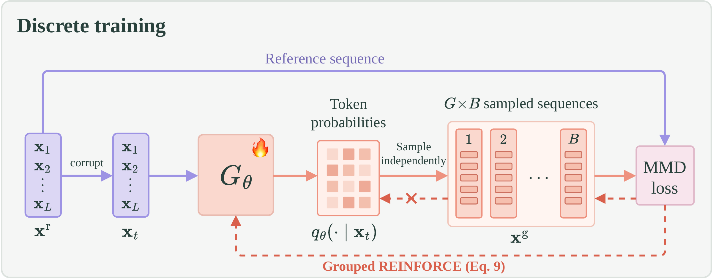
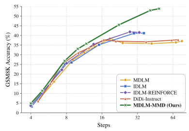

# MDLM-MMD

PyTorch implementation of **MDLM-MMD**, the masked discrete diffusion method from *Representation-Space MMD for Diffusion Language Models*. This branch contains training and evaluation on OpenWebText and TinyGSM/GSM8K.

[](assets/discrete_training.pdf)

## Installation

To get started, create a conda environment containing the required dependencies following [Duo's installation steps](https://github.com/s-sahoo/duo#getting-started).

```bash
conda create -n mmd python=3.12
conda activate mmd
conda install nvidia/label/cuda-12.4.0::cuda-toolkit
python -m pip install -r requirements.txt
python -m pip install flash_attn==2.7.4.post1 --no-build-isolation
```

## Checkpoints

Training and evaluation scripts automatically download the checkpoints and tokenizers below and cache them for later runs.

**Pretrained models:** used to initialize the student and frozen feature extractor.

| Task | Checkpoint | Tokenizer |
| --- | --- | --- |
| OpenWebText | [🤗 kuleshov-group/mdlm-owt](https://huggingface.co/kuleshov-group/mdlm-owt) | [🤗 openai-community/gpt2](https://huggingface.co/openai-community/gpt2) |
| TinyGSM | [🤗 jdeschena/s-flm](https://huggingface.co/jdeschena/s-flm/blob/main/tinygsm/mdlm.ckpt) | [🤗 HuggingFaceTB/SmolLM-135M](https://huggingface.co/HuggingFaceTB/SmolLM-135M) |

**Post-trained models:**

| Task | Checkpoint |
| --- | --- |
| OpenWebText | [🤗 yresearch/MDLM-MMD-OWT](https://huggingface.co/yresearch/MDLM-MMD-OWT) |
| TinyGSM | [🤗 yresearch/MDLM-MMD-TinyGSM](https://huggingface.co/yresearch/MDLM-MMD-TinyGSM) |

## Reference Results

**OpenWebText:** MDLM-MMD results averaged over five seeds, using 1,000 generated sequences of length 1,024 per seed and GPT-2 Large for generative perplexity.

| Sampling steps | Gen. PPL ↓ | Entropy |
| --- | --- | --- |
| 8 | 43.50 | 5.43 |
| 16 | 26.84 | 5.42 |
| 32 | 21.46 | 5.39 |

**GSM8K:** MDLM-MMD reaches approximately 54% final-answer accuracy at approximately 49 model forward passes per sequence, using confidence-threshold decoding.

[](assets/tinygsm_results.pdf)

## Evaluation

Run the standalone scripts from the repository root on one CUDA GPU to evaluate the post-trained models using EMA weights.

**OpenWebText:**

```bash
bash scripts/generation_mmd_mdlm.sh
```

Evaluates five seeds with 1,000 samples per seed at 8, 16, and 32 sampling steps across 12 temperatures. Saves GPT-2-large generative perplexity and token entropy to `owt_eval.json`.

**GSM8K:**

```bash
bash scripts/generation_mmd_mdlm_tinygsm.sh
```

Evaluates all 1,319 GSM8K test questions using 14 confidence thresholds. Saves executed-answer accuracy and mean forward passes per example to `tinygsm_eval.json`.

## Data Preparation

The training scripts automatically download and cache these tokenized datasets.

| Dataset / tokenizer | Hugging Face dataset |
| --- | --- |
| OpenWebText / GPT-2 | [🤗 iasudakov/owt-gpt2](https://huggingface.co/datasets/iasudakov/owt-gpt2) |
| TinyGSM / SmolLM-135M | [🤗 yresearch/tinygsm-smollm](https://huggingface.co/datasets/yresearch/tinygsm-smollm) |

**OpenWebText:** preparation reserves the last 100,000 documents for validation, appends EOS to each document, and packs tokens into 1,024-token blocks including BOS/EOS. Incomplete trailing blocks are dropped. Raw-data preparation is implemented in [dataloader.py](dataloader.py): `get_dataset` and `_group_texts`.

**TinyGSM:** preparation tokenizes `TinyGSM/TinyGSM` question/code pairs using `get_tiny_gsm_dataset` in [dataloader.py](dataloader.py). Evaluation separately downloads the [GSM8K test set](https://huggingface.co/datasets/openai/gsm8k) and saves its questions and reference answers as JSON.

## Training

Run from the repository root with 8 CUDA GPUs.

**OpenWebText:**

```bash
bash scripts/train_mmd_mdlm.sh
```

**TinyGSM:**

```bash
bash scripts/train_mmd_mdlm_tinygsm.sh
```

## Acknowledgements

This repository builds on the [IDLM](https://github.com/David-cripto/IDLM). We thank the authors for making their code available.